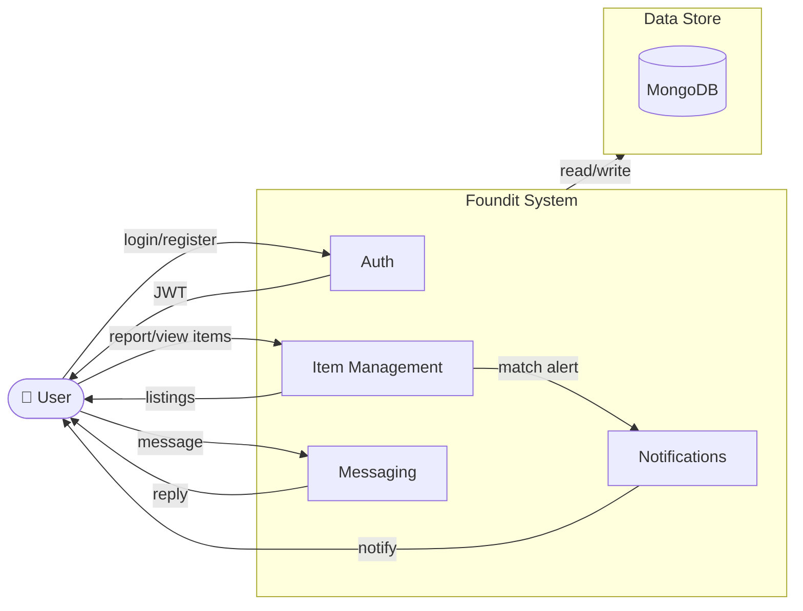

# Data Flow Diagram — Foundit

```mermaid
flowchart LR
    U([👤 User])

    subgraph System ["Foundit System"]
        AUTH["Auth"]
        ITEMS["Item Management"]
        CHAT["Messaging"]
        NOTIF["Notifications"]
    end

    subgraph Storage ["Data Store"]
        DB[(MongoDB)]
    end

    U -- "login/register" --> AUTH
    AUTH -- "JWT" --> U

    U -- "report/view items" --> ITEMS
    ITEMS -- "listings" --> U
    ITEMS -- "match alert" --> NOTIF
    NOTIF -- "notify" --> U

    U -- "message" --> CHAT
    CHAT -- "reply" --> U

    System -- "read/write" --> Storage
```
