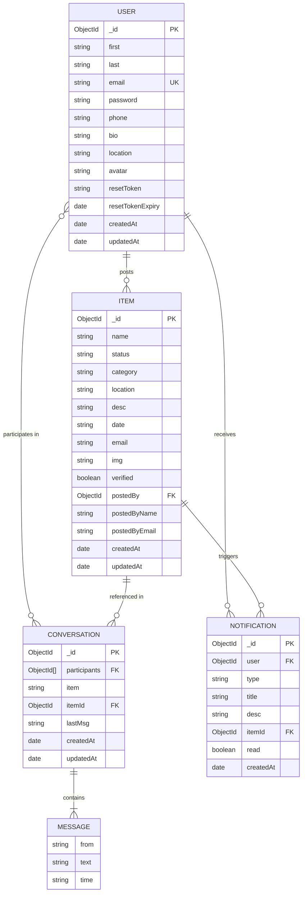

# ER Diagram — Foundit Lost & Found System

```mermaid
erDiagram
    USER {
        ObjectId _id PK
        string first
        string last
        string email UK
        string password
        string phone
        string bio
        string location
        string avatar
        string resetToken
        date resetTokenExpiry
        date createdAt
        date updatedAt
    }

    ITEM {
        ObjectId _id PK
        string name
        string status
        string category
        string location
        string desc
        string date
        string email
        string img
        boolean verified
        ObjectId postedBy FK
        string postedByName
        string postedByEmail
        date createdAt
        date updatedAt
    }

    CONVERSATION {
        ObjectId _id PK
        ObjectId[] participants FK
        string item
        ObjectId itemId FK
        string lastMsg
        date createdAt
        date updatedAt
    }

    MESSAGE {
        string from
        string text
        string time
    }

    NOTIFICATION {
        ObjectId _id PK
        ObjectId user FK
        string type
        string title
        string desc
        ObjectId itemId FK
        boolean read
        date createdAt
    }

    USER ||--o{ ITEM : "posts"
    USER ||--o{ NOTIFICATION : "receives"
    USER }o--o{ CONVERSATION : "participates in"
    ITEM ||--o{ NOTIFICATION : "triggers"
    ITEM ||--o{ CONVERSATION : "referenced in"
    CONVERSATION ||--|{ MESSAGE : "contains"
```
