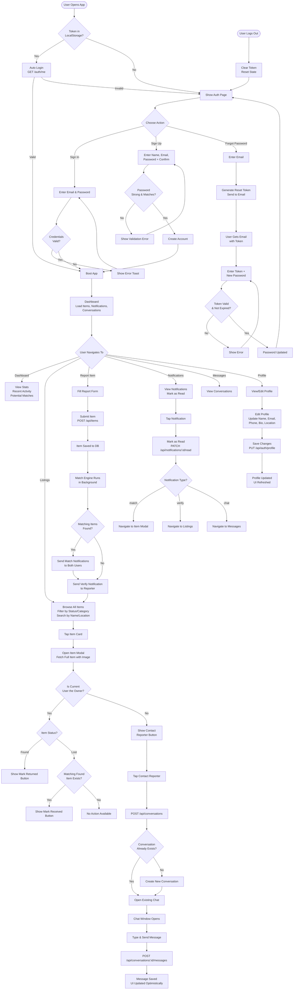

# Flowchart — Foundit Lost & Found System

```mermaid
flowchart TD
    A([User Opens App]) --> B{Token in\nLocalStorage?}

    B -- Yes --> C[Auto Login\nGET /auth/me]
    B -- No --> D[Show Auth Page]

    C -- Valid --> E[Boot App]
    C -- Invalid --> D

    D --> D1{Choose Action}
    D1 -- Sign In --> F[Enter Email & Password]
    D1 -- Sign Up --> G[Enter Name, Email,\nPassword + Confirm]
    D1 -- Forgot Password --> H[Enter Email]

    F --> F1{Credentials\nValid?}
    F1 -- No --> F2[Show Error Toast] --> F
    F1 -- Yes --> E

    G --> G1{Password\nStrong & Matches?}
    G1 -- No --> G2[Show Validation Error] --> G
    G1 -- Yes --> G3[Create Account] --> E

    H --> H1[Generate Reset Token\nSend to Email]
    H1 --> H2[User Gets Email\nwith Token]
    H2 --> H3[Enter Token +\nNew Password]
    H3 --> H4{Token Valid\n& Not Expired?}
    H4 -- No --> H5[Show Error] --> H3
    H4 -- Yes --> H6[Password Updated] --> D

    E --> DASH[Dashboard\nLoad Items, Notifications,\nConversations]

    DASH --> NAV{User Navigates To}

    NAV -- Dashboard --> DA[View Stats\nRecent Activity\nPotential Matches]
    NAV -- Listings --> LI[Browse All Items\nFilter by Status/Category\nSearch by Name/Location]
    NAV -- Report Item --> RI[Fill Report Form]
    NAV -- Notifications --> NO[View Notifications\nMark as Read]
    NAV -- Messages --> CH[View Conversations]
    NAV -- Profile --> PR[View/Edit Profile]

    RI --> RI1[Submit Item\nPOST /api/items]
    RI1 --> RI2[Item Saved to DB]
    RI2 --> RI3[Match Engine Runs\nin Background]
    RI3 --> RI4{Matching Items\nFound?}
    RI4 -- Yes --> RI5[Send Match Notifications\nto Both Users]
    RI4 -- No --> RI6[Send Verify Notification\nto Reporter]
    RI5 --> RI6
    RI6 --> LI

    LI --> LI1[Tap Item Card]
    LI1 --> LI2[Open Item Modal\nFetch Full Item with Image]
    LI2 --> LI3{Is Current\nUser the Owner?}
    LI3 -- Yes --> LI4{Item Status?}
    LI3 -- No --> LI5[Show Contact\nReporter Button]

    LI4 -- Found --> LI6[Show Mark Returned Button]
    LI4 -- Lost --> LI7{Matching Found\nItem Exists?}
    LI7 -- Yes --> LI8[Show Mark Received Button]
    LI7 -- No --> LI9[No Action Available]

    LI5 --> LI10[Tap Contact Reporter]
    LI10 --> LI11[POST /api/conversations]
    LI11 --> LI12{Conversation\nAlready Exists?}
    LI12 -- Yes --> LI13[Open Existing Chat]
    LI12 -- No --> LI14[Create New Conversation]
    LI14 --> LI13

    LI13 --> CH1[Chat Window Opens]
    CH1 --> CH2[Type & Send Message]
    CH2 --> CH3[POST /api/conversations/:id/messages]
    CH3 --> CH4[Message Saved\nUI Updated Optimistically]

    NO --> NO1[Tap Notification]
    NO1 --> NO2[Mark as Read\nPATCH /api/notifications/:id/read]
    NO2 --> NO3{Notification Type?}
    NO3 -- match --> NO4[Navigate to Item Modal]
    NO3 -- verify --> NO5[Navigate to Listings]
    NO3 -- chat --> NO6[Navigate to Messages]

    PR --> PR1[Edit Profile\nUpdate Name, Email,\nPhone, Bio, Location]
    PR1 --> PR2[Save Changes\nPUT /api/auth/profile]
    PR2 --> PR3[Profile Updated\nUI Refreshed]

    LOGOUT([User Logs Out]) --> LO1[Clear Token\nReset State]
    LO1 --> D
```
